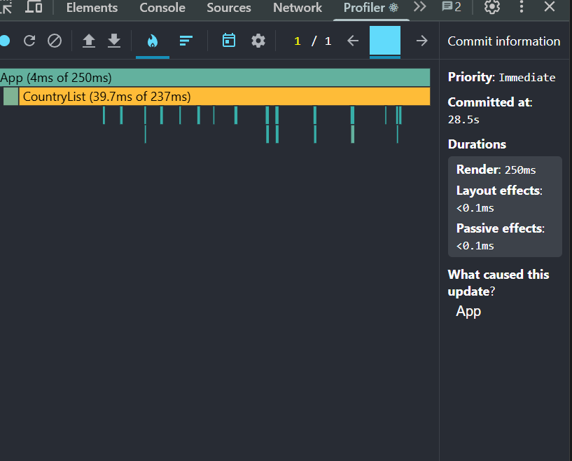
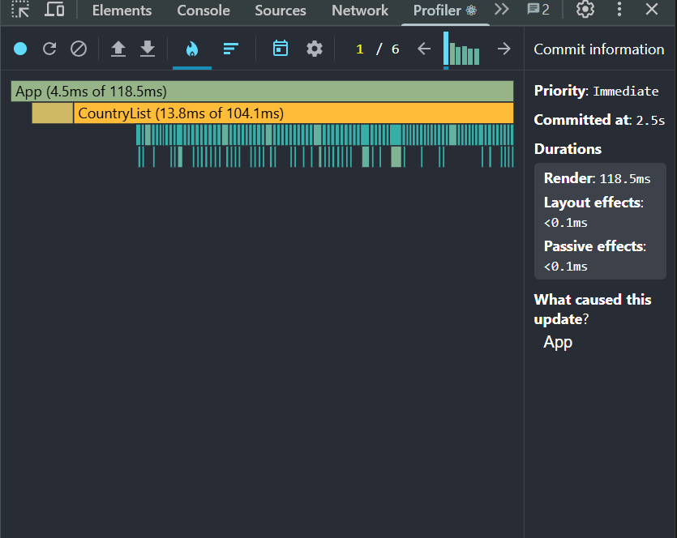
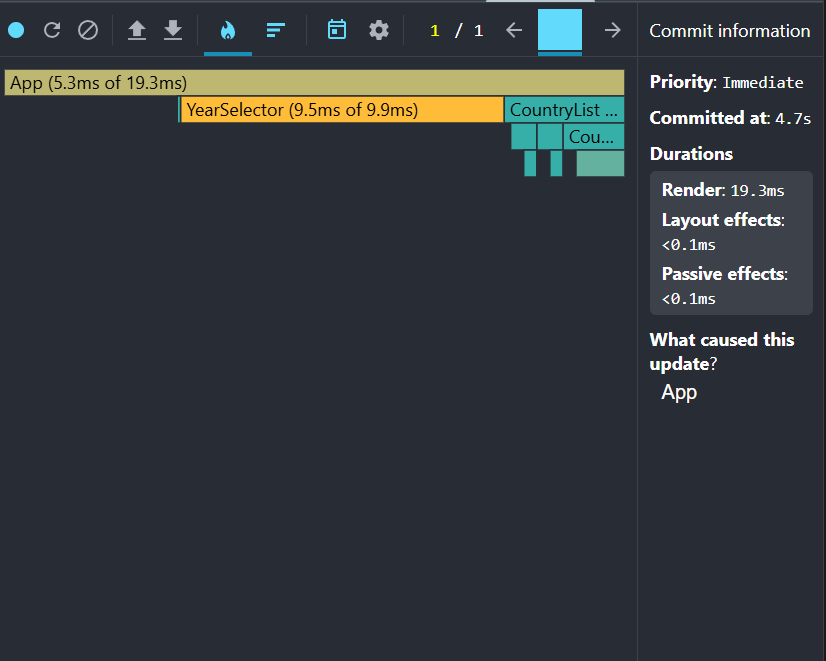
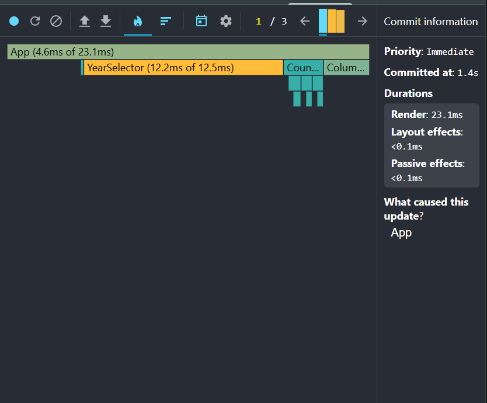
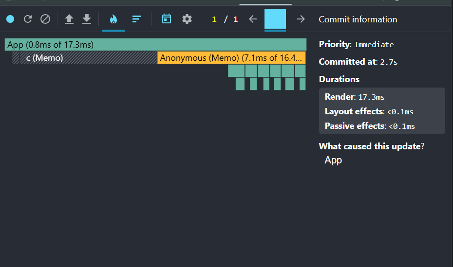
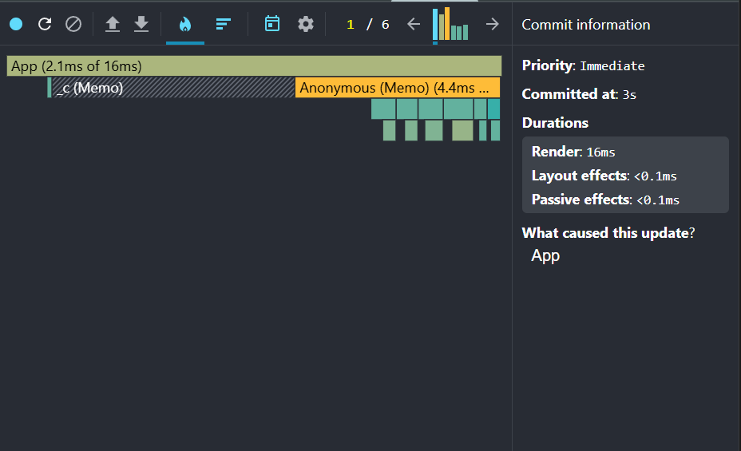
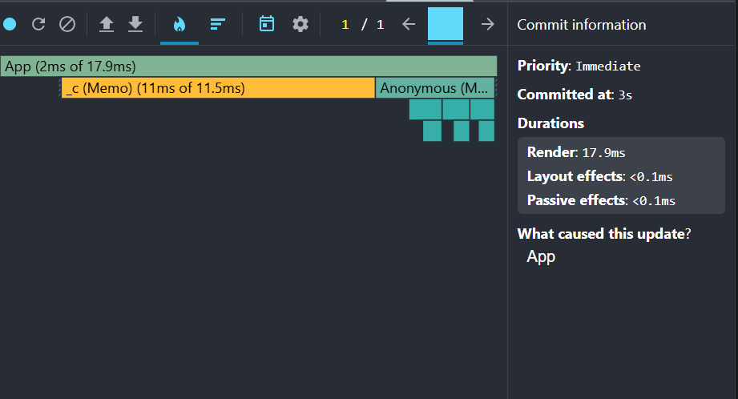
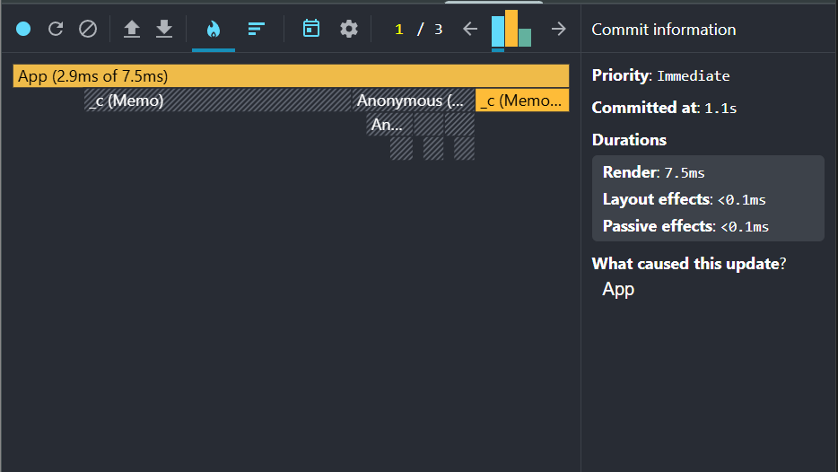

# Performance Optimization Report

## How to Read This Report

### Key Terms

**Render duration** — time React spent calling component functions and computing the virtual DOM (reconciliation). Shown as "Render: Xms" in the DevTools Profiler right panel.

**Commit duration** — total time for one commit cycle: render + DOM mutations + effects (useLayoutEffect + useEffect). Formula: `Render + Layout effects + Passive effects`. In this app both values are equal because there are no heavy effects (<0.1ms).

**Commit** — one discrete update React applies to the DOM. A single user interaction can trigger multiple commits (e.g., typing "United" = 6 commits, one per keystroke).

**Flame chart** — tree visualization of component renders. Block width = render time. The label format `ComponentName (Xms of Yms)` means:
- `Xms` = time spent in this component itself (self time, excluding children)
- `Yms` = total time including all descendants

**What to look for:**
- Wide orange/yellow blocks = slow components
- Many small blocks = many components re-rendering unnecessarily
- A component appearing when its props did not change = missing `React.memo`

---

## Baseline Measurements

> Profiled in **development mode** with React DevTools Profiler (recording stopped after each interaction).
> Screenshots: `screenshots/baseline/`

### Interaction A: Sort countries

- **Commit duration**: 250ms
- **Render duration**: 250ms
- **Flame chart hotspot**: `CountryList (39.7ms of 237ms)` — CountryList accounts for 95% of render time. All ~250 CountryCard components re-render on every sort.
- **Screenshot**: 

### Interaction B: Search countries

- **Commit duration**: 118.5ms (per commit; 6 commits total — one per keystroke)
- **Render duration**: 118.5ms
- **Flame chart hotspot**: `CountryList (13.8ms of 104.1ms)` — every keystroke re-renders all visible CountryCards even when results don't change yet.
- **Screenshot**: 

### Interaction C: Change year

- **Commit duration**: 19.3ms
- **Render duration**: 19.3ms
- **Flame chart hotspot**: `YearSelector (9.5ms of 9.9ms)` — YearSelector re-renders despite its own value not changing (no `React.memo`).
- **Screenshot**: 

### Interaction D: Toggle column

- **Commit duration**: 23.1ms (commit 1 of 3)
- **Render duration**: 23.1ms
- **Flame chart hotspot**: `YearSelector (12.2ms of 12.5ms)` — YearSelector re-renders when a column is toggled, even though year state is unchanged. Classic case for `React.memo`.
- **Screenshot**: 

---

## Optimized Measurements

> Profiled in **development mode** after applying all optimizations.
> Screenshots: `screenshots/optimized/`

### Interaction A: Sort countries

- **Commit duration**: 17.3ms
- **Render duration**: 17.3ms
- **Flame chart**: `_c (Memo)` with hatching — CountryList bailed out of re-render (React.memo). Only `Anonymous (Memo) (7.1ms of 16.4ms)` — the virtual scroll container — renders ~8 visible cards instead of 250.
- **Screenshot**: 

### Interaction B: Search countries

- **Commit duration**: 16ms (per commit; 6 commits total)
- **Render duration**: 16ms
- **Flame chart**: Same pattern — CountryList memo + virtual list renders only visible items `(4.4ms)`. Each keystroke now costs 16ms instead of 118.5ms.
- **Screenshot**: 

### Interaction C: Change year

- **Commit duration**: 17.9ms
- **Render duration**: 17.9ms
- **Flame chart**: `_c (Memo) (11ms of 11.5ms)` — CountryList re-renders (year is in its deps so memo correctly allows it), but only the virtual list's visible items update. `YearSelector` no longer appears — React.memo prevents its unnecessary re-render.
- **Screenshot**: 

### Interaction D: Toggle column

- **Commit duration**: 7.5ms (commit 1 of 3 — opening the modal)
- **Render duration**: 7.5ms
- **Flame chart**: `_c (Memo)` hatched — CountryList skipped entirely (column modal open doesn't change CountryList's props). `YearSelector` absent. Only `ColumnModal` renders.
- **Screenshot**: 

---

## Summary of Improvements

| Interaction      | Baseline (ms) | Optimized (ms) | Improvement |
| ---------------- | ------------- | -------------- | ----------- |
| Sort countries   | 250           | 17.3           | 93.1%       |
| Search countries | 118.5         | 16             | 86.5%       |
| Change year      | 19.3          | 17.9           | 7.3%        |
| Toggle column    | 23.1          | 7.5            | 67.5%       |
| **Average**      | **102.7**     | **14.7**       | **85.7%**   |
